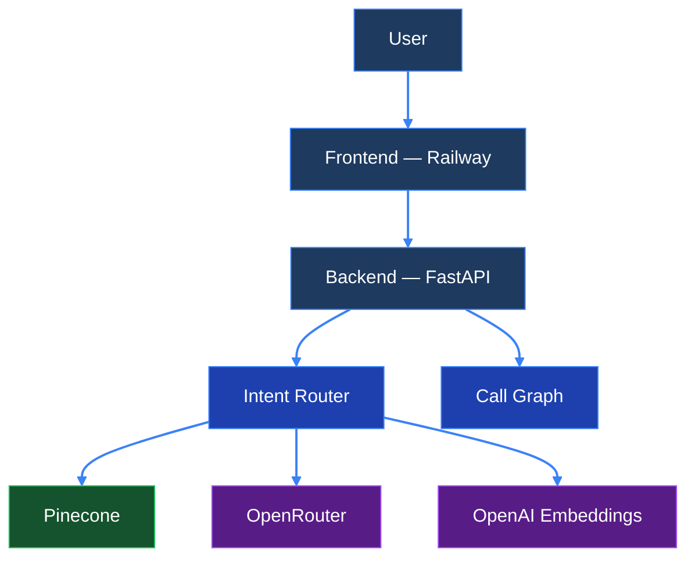
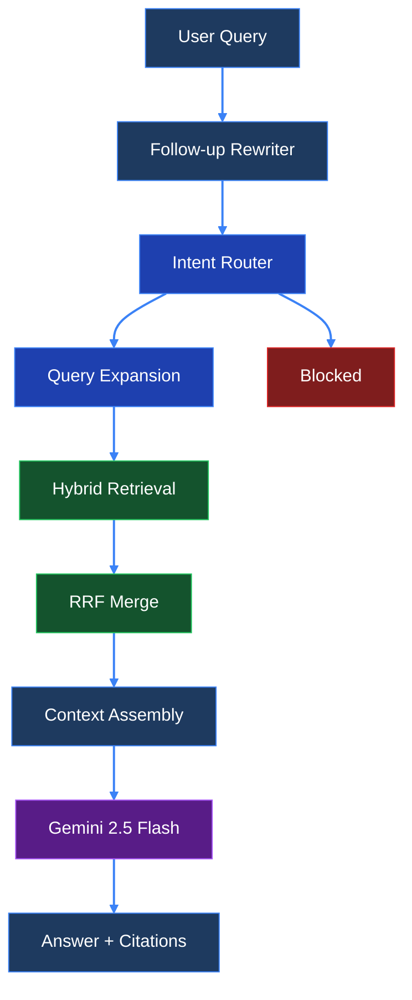
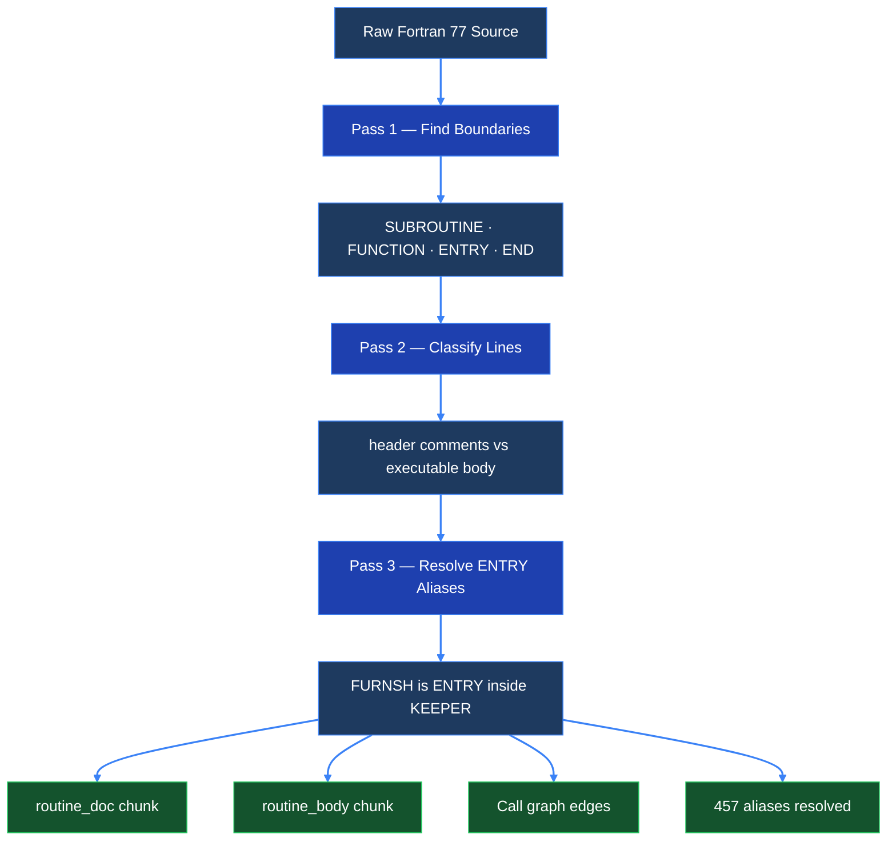
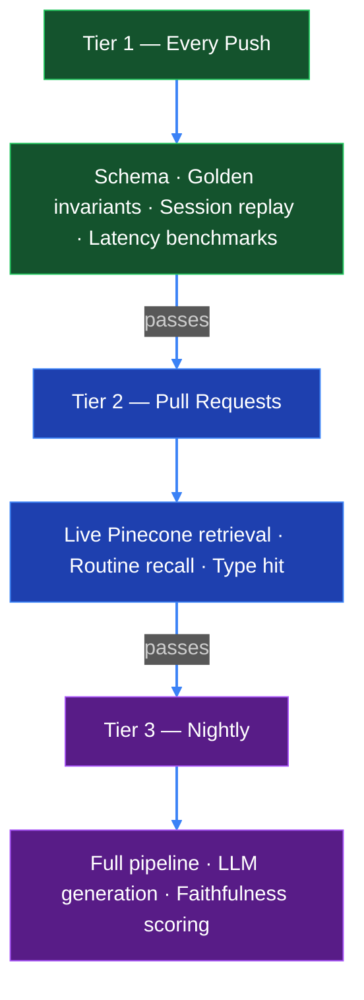

# LegacyLens
### Week Three — Gauntlet AI

**Henry DeGrasse**

---

# The Challenge

**Retrieval-Augmented Generation for Legacy Code**

Turn a legacy codebase into something queryable through natural language

- Ingest source code into a vector database
- Retrieve relevant code chunks per query
- Ground LLM answers in **actual source code** with citations
- Build code-understanding features: explain, deps, impact, patterns

<!-- pause -->

## The Target: NASA NAIF SPICE Toolkit

The library JPL uses for **spacecraft navigation**

> Voyager · Cassini · Mars rovers · Europa Clipper

Written in **Fortran 77** — fixed-form, column-sensitive, 1977

```
  Col 1     → Comment
  Col 6     → Continuation line
  Col 7-72  → Code
  Col 73+   → Ignored  (punch card era)
```

| | |
|---|---|
| Lines of code | **965,146** |
| Source files | **1,816** `.f` + **113** `.inc` |
| Routines parsed | **1,816** + **457** ENTRY points |
| Call graph edges | **12,719** |

No tree-sitter grammar. No off-the-shelf parser works.

---

# Architecture: System Design



---

# Architecture: RAG Pipeline



---

# Hardest Challenge: The Fortran 77 Parser

No off-the-shelf parser understands Fortran 77 — the *column a character
is on* determines what it means. You can't split by lines, you can't
split by tokens, and LangChain has never heard of it.

So I wrote a **3-pass parser from scratch** — it reads every source file,
figures out where routines start and end, separates documentation from
code, and then handles the really tricky part: **ENTRY points**, where
one function is secretly hiding inside another 4,000-line file
under a completely different name.



---

# Hardest Challenge: Latency

## 12s → 1.5s

| Optimization | Savings |
|---|---|
| GPT-4o-mini → Gemini 2.5 Flash | **−8s** |
| Disable model thinking | −400ms |
| Parallel Pinecone queries | −300ms |
| Query expansion | −500ms |
| Embedding cache + answer cache | → **0.1s cached** |

**Cold: 1.5s median · Cached: 0.1s · Router: 0.03ms**

---

# Evals: Why They Matter

RAG systems break **silently** — a model swap, a schema change,
a new chunk type can all degrade retrieval without raising an error



---

# Evals: Results

| Metric | Result |
|---|---|
| Router accuracy | **100%** (25/25) |
| Routine recall | **100%** |
| Answer faithfulness | **100%** (25/25) |
| Unit tests | **378** |
| Eval categories | explain · deps · impact · pattern · semantic · entry · adversarial |

---

# Live Demo

**legacylens-production-9578.up.railway.app**

| # | Query | Shows |
|---|---|---|
| 1 | `What does SPKEZ do?` | Core RAG · streaming · citations |
| 2 | `/deps FURNSH` | Call graph · ENTRY alias · $0 |
| 3 | `/impact CHKIN` | 1,257 callers · blast radius |
| 4 | `How does the spacecraft track position?` | Query expansion |
| 5 | `What's the weather today?` | Guardrail · blocked · $0 |
| 6 | `What about its parameters?` | Multi-turn follow-up |

<!-- pause -->

**96 commits · 378 tests · 25 golden evals · $5.61 total**
