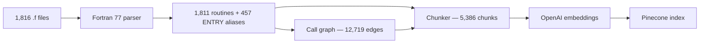
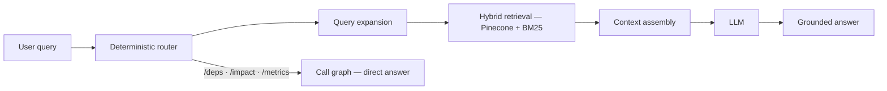

# LegacyLens

## RAG over NASA's SPICE Toolkit — 965K lines of Fortran 77

<!-- pause -->

**SPICE** is the navigation library NASA uses to compute spacecraft positions, instrument pointing, and time conversions.

It is written in **fixed-form Fortran 77** — a language older than most of us.

<!-- pause -->

I built a system that lets you **ask questions about it in plain English** and get **source-grounded answers with file:line citations**.

---

# Why Fortran 77 Breaks Normal Code RAG

```text
col:  1      6 7                                          72
      |      | |                                          |
      C  Docs live in comment lines starting with C
      C$Procedure SPKEZ ( S/P Kernel, easier )
      C
            SUBROUTINE SPKEZ ( TARG, ET, REF, ABCORR, OBS,
     .                          STARG, LT )
      ^      ^
      |      └─ col 6: any char here = continuation line
      └──────── col 1: C = comment
```

<!-- pause -->

- A **C in column 1** marks a comment — that's where all the docs live
- A **character in column 6** means this line continues the previous statement
- Code only exists in **columns 7–72** — everything else is ignored
- **ENTRY points** let one subroutine expose multiple callable names

<!-- pause -->

A generic text splitter destroys all of this. So I wrote a **custom Fortran 77 parser**.

---

# Ingestion — Parsing to Vectors



<!-- pause -->

**Four chunk types**: `routine_doc` · `routine_body` · `routine_segment` · `include`

Each chunk carries its routine name, file path, line range, and call metadata.

---

# Query Pipeline — Route, Retrieve, Generate



<!-- pause -->

- **Router**: regex-based, zero LLM cost, blocks prompt injection
- **Hybrid search**: vector similarity + BM25 keywords, merged via **Reciprocal Rank Fusion**
- **Structural queries** like `/deps` and `/impact` skip the LLM entirely — answered from the call graph

---

# Hardest Problem — The Vocabulary Gap

Users say: *"How does a spacecraft track its position?"*

The code says: `SPKEZ`, `SPKEZR`, `SPKPOS`

<!-- pause -->

### How I solved it

**Deterministic query expansion** — no extra LLM call:

```text
"spacecraft position"
  → ephemeris, state vector, SPKEZ, SPKEZR, SPKPOS
```

<!-- pause -->

Combined with:
- **ENTRY alias resolution** — `FURNSH` is actually inside `KEEPER`
- **Doc-first ranking** — explanation chunks beat raw code segments
- **Hybrid retrieval** — keywords catch exact routine names that vectors miss

---

# What It Can Do

| Command | What happens |
|---|---|
| *"What does SPKEZ do?"* | RAG answer with source citations |
| `/explain FURNSH` | Purpose, params, deps — resolves ENTRY alias |
| `/deps FURNSH` | Call graph traversal |
| `/impact CHKIN` | Reverse deps — 1,257 callers |
| `/metrics SPKEZ` | Cyclomatic complexity, LOC — no LLM needed |
| *"How does SPICE handle time?"* | Query expansion → relevant routines |

<!-- pause -->

**Interfaces**: Web UI with streaming · Textual TUI · CLI · REST API

---

# Engineering Rigor

| | |
|---|---:|
| Tests collected | **378** |
| Golden eval cases | **25** |
| Routines indexed | **1,811** + **457** aliases |
| Call graph edges | **12,719** |
| Chunks indexed | **5,386** |
| Embedding cost (one-time) | **$0.16** |
| Total dev spend | **$5.61** |
| Median E2E latency | **~1.5s** |

<!-- pause -->

**Three-tier CI**: schema invariants → retrieval evals → full pipeline evals

Recorded session **replay fixtures** for regression testing without model cost.

---

# Demo

### Let me show you.

<!-- pause -->

**1.** *What does SPKEZ do?* — core RAG path

<!-- pause -->

**2.** */deps FURNSH* — call graph + ENTRY alias resolution

<!-- pause -->

**3.** *How does the spacecraft track its position?* — query expansion

<!-- pause -->

**4.** */impact CHKIN* — blast radius on a heavily-used routine

---

# Takeaway

LegacyLens treats legacy code understanding as a **systems problem**, not a prompting problem.

<!-- pause -->

- Custom **parsing** for a language no tool supports well
- **Graph analysis** where structure matters
- **Hybrid retrieval** where recall matters
- **LLM synthesis** only where explanation matters

<!-- pause -->

> Better retrieval architecture matters more than fancier prompting.
